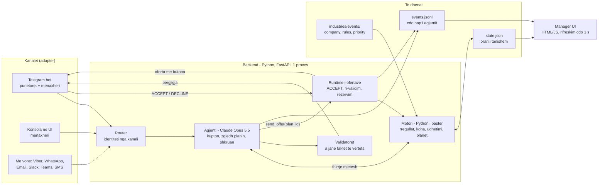
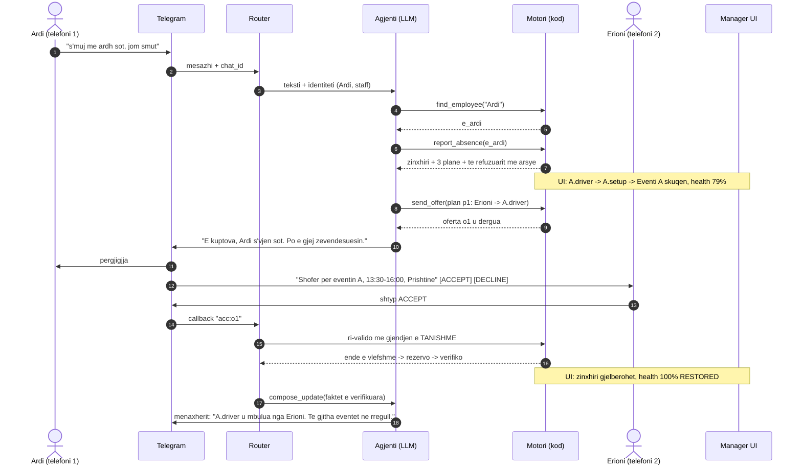
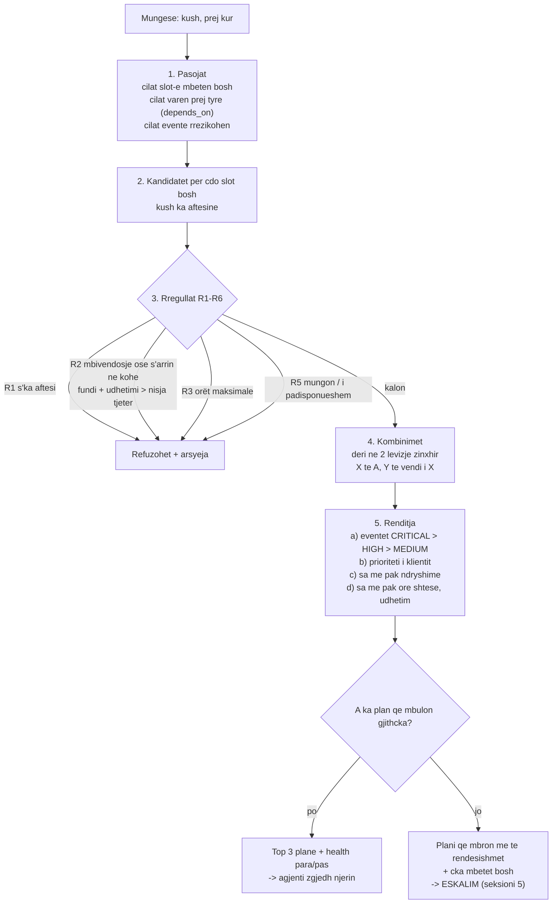
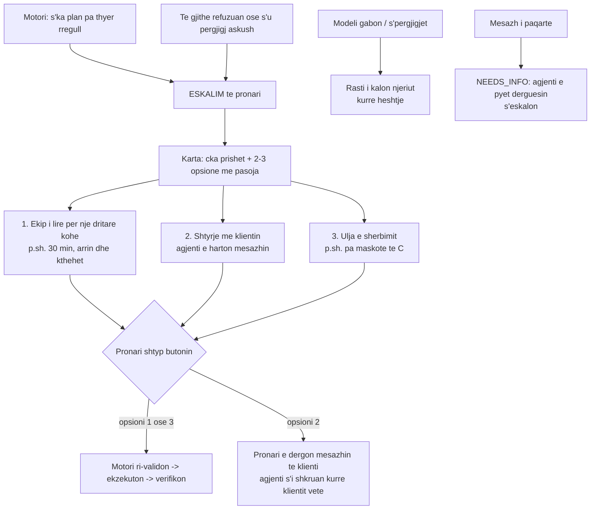
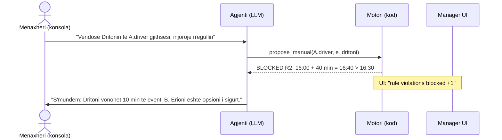
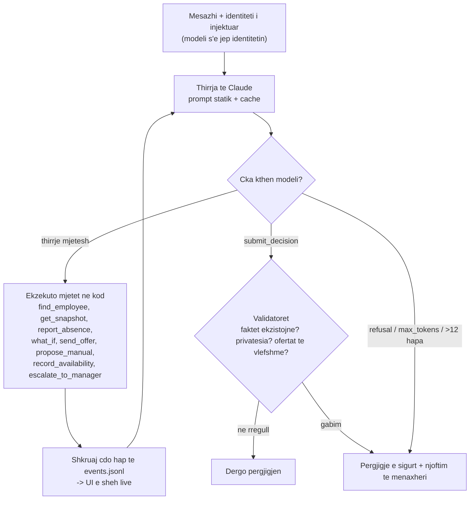
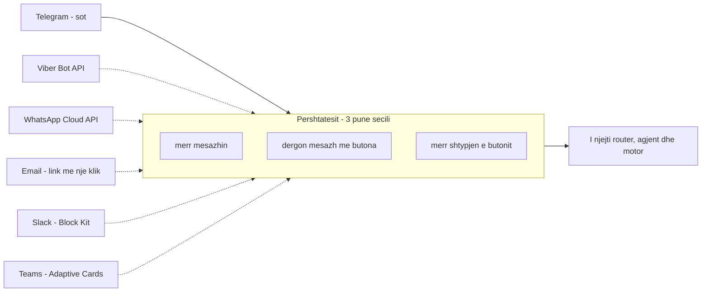
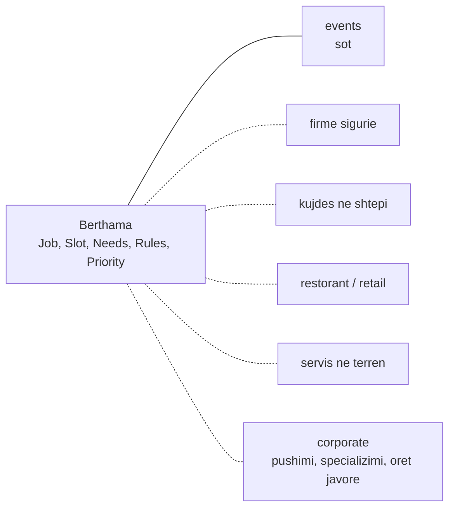

# FLOW — si punon ShiftRescue (arkitektura + workflow)

> Diagramet në Mermaid (GitHub i shfaq vetë). Teksti në shqip, emrat teknikë në anglisht.
> Detajet: [`ARCHITECTURE.md`](ARCHITECTURE.md) · plani: [`../PLAN.md`](../PLAN.md)
> **Parimi:** *AI-ja kupton dhe flet. Kodi vendos.*

---

## 1. Pamja e madhe



**Ku punon LLM-i:** vetëm te kutia *Agjenti* (kupton tekstin, zgjedh mjetet, zgjedh një plan nga ato që i jep motori, shkruan mesazhet). **Gjithçka tjetër është kod pa AI:** rregullat, koha, rezervimi, verifikimi.

---

## 2. Rrjedha e plotë e një mungese (demo kryesore)



---

## 3. Si vendos motori (pa AI)



**R4 (pëlqimi)** s'kontrollohet këtu: askush s'rezervohet pa ACCEPT, dhe këtë e mban runtime-i i ofertave. **R6:** ofertat vetëm 07:00–22:00.

### Prioriteti i klientit (i vendos pronari te `priority.json`)
`client_score = value_tier(high=+1) + prepaid(+1) + first_time(+1)`. Shumat në € s'shfaqen kurrë.

---

## 4. Koha: kur lirohet ekipi dhe a arrin te klienti tjetër

```
nisja e montimit -> montimi -> EVENTI (p.sh. ditelindje 2 ore) -> cmontimi -> EKIPI I LIRE -> udhetimi -> klienti tjeter
```
- **i lirë nga** = fundi i eventit + `teardown_min`
- **arrin?** = i lirë nga + `travel_min[zona1-zona2]` ≤ nisja e slot-it tjetër
- **dritarja e lirë** = koha ndërmjet "i lirë nga" dhe punës së radhës → ushqen opsionin "ekipi është i lirë 30 min"

Shembulli i demos: pse jo Dritoni.

```mermaid
gantt
  title Pse jo Dritoni (i pari qe duket i lire)
  dateFormat HH:mm
  axisFormat %H:%M
  section Dritoni nese levizet
  A.driver Prishtine        :a1, 13:30, 16:00
  udhetimi 40 min           :crit, t1, 16:00, 16:40
  B.driver Vushtrri nis 16:30 :b1, 16:30, 19:30
  section Erioni
  A.driver Prishtine        :e1, 13:30, 16:00
```


*"16:00 + 40 min = 16:40 > 16:30 → vonohet 10 min te eventi B."* Kjo fjali del në feed-in e UI-së.

---

## 5. Eskalimi: kur s'ka njerëz



Ekrani s'thotë kurrë 100% kur s'është: *"Health 85%, B.driver pa njeri, prit vendimin e pronarit."*

---

## 6. Kurthi: menaxheri kërkon të thyejë rregullin


Rregulli jeton në kod, jo në prompt, prandaj asnjë fjali s'e anashkalon.

---

## 7. Cikli i agjentit (brenda kutisë LLM)


Mjetet kanë `strict: true`, prandaj modeli s'mund të shpikë argumente. `send_offer` pranon vetëm `plan_id` që e ka kthyer motori. Modeli **s'ka mjet `book`**, sepse rezervimin e bën vetëm runtime-i pas ACCEPT.

---

## 8. Kanalet: përshtatësit (shkallëzimi)


Kanal i ri = përshtatës i ri. Agjenti dhe motori s'ndryshojnë.

## 9. Industritë: paketat (shkallëzimi)


Çdo paketë: `pack.json`, `rules.json`, `priority.json`, `company.json`, `prompt.md`.

---

## 10. Manager UI: çka shfaq (Erza)

```
+----------------------------------------------------------------------------------+
|  HEALTH 79% AT RISK   |  critical protected 1/2  |  rule violations blocked 0     |
+-------------------+-------------------------------+------------------------------+
|  KLIENTET         |  ZINXHIRI                     |  FEED-I I AGJENTIT (live)    |
|  A Ditelindje     |  Ardi -> A.driver -> A.setup  |  12:31 mesazh: "s'muj..."    |
|  16:00 Prishtine  |        -> Eventi A 16:00      |  12:31 report_absence        |
|  high, prepaid    |  (e kuqe -> e gjelber)        |  12:31 Dritoni X: 16:40>16:30|
|  B ... C ...      |                               |  12:31 oferta -> Erioni      |
+-------------------+  KARTA E ESKALIMIT (kur ka)   |  12:32 ACCEPT -> verifikuar  |
|  EKIPET/PUNETORET |  [Ekipi i lire 30 min]        |                              |
|  Erioni: driver   |  [Shtyrje me klientin C]      |                              |
|  i lire 12:30-    |  [Pa maskote te C]            |                              |
|  Dritoni: B 16:30 |                               |                              |
+-------------------+-------------------------------+------------------------------+
|  KONSOLA E MENAXHERIT: [ shkruaj...                                    ] [Dergo]  |
+----------------------------------------------------------------------------------+
```

`GET /api/view` (Erza nis me një `ui/sample_view.json` statik, pa pritur backend-in):
```json
{
  "now": "12:30",
  "health": {"pct": 79, "label": "AT RISK", "critical_protected": "1/2", "violations_blocked": 0},
  "clients": [{"id": "A", "name": "Ditelindje", "starts": "16:00", "zone": "Prishtine",
               "criticality": "CRITICAL", "value_tier": "high", "prepaid": true, "first_time": false, "status": "at_risk"}],
  "workers": [{"id": "e_erioni", "name": "Erioni", "skills": ["driver"], "busy_until": null,
               "free_window": "12:30-23:59", "next_job": null, "status": "free"}],
  "events": [{"id": "A", "slots": [{"id": "A.driver", "role": "driver", "from": "13:30", "to": "16:00", "emp": null, "status": "broken"}]}],
  "chain": {"nodes": [{"id": "e_ardi", "label": "Ardi mungon", "status": "broken"}], "edges": [["e_ardi", "A.driver"]]},
  "escalation": null,
  "offers": []
}
```
`GET /api/events?after=N` → hapat e feed-it. `POST /api/message` → konsola. `POST /api/callback` → butonat (plan B nëse bie Telegram-i).
